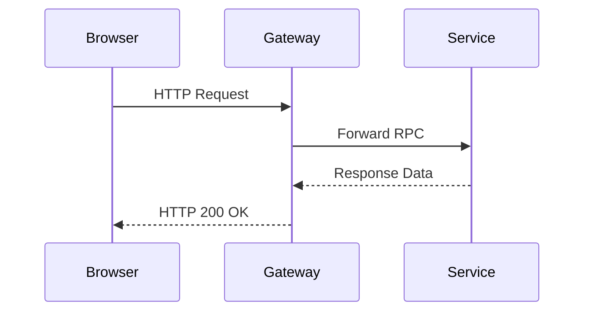
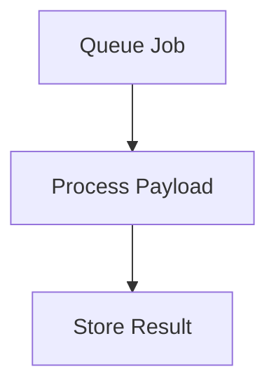

# Architecture Document

Here is our request flow:

```mermaid
sequenceDiagram
    participant Browser
    participant Gateway
    participant Service
    Browser->>Gateway: HTTP Request
    Gateway->>Service: Forward RPC
    Service-->>Gateway: Response Data
    Gateway-->>Browser: HTTP 200 OK
```

And the worker pipeline:

```mermaid
graph TD
    A[Queue Job] --> B[Process Payload]
    B --> C[Store Result]
```
