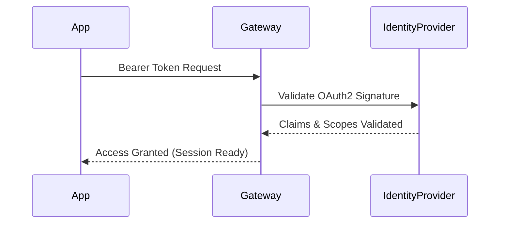
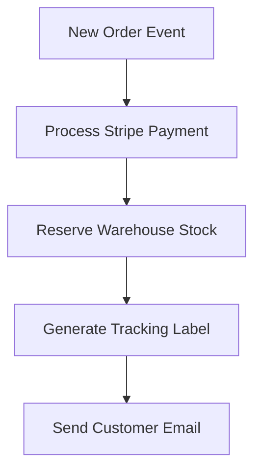
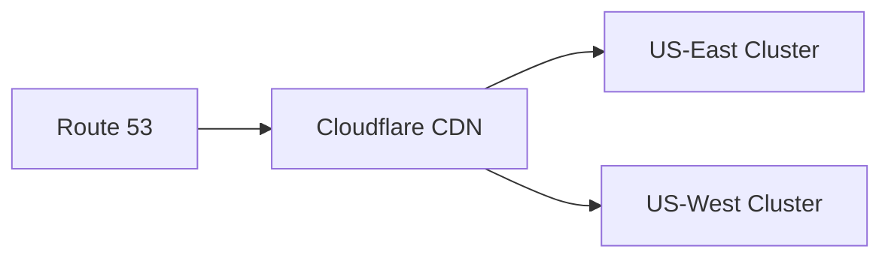

# Microservices Architecture & Flow

This document details the system design for our event-driven architecture.

## 1. Authentication Handshake

## 2. Order Fulfillment Pipeline

## 3. High Availability Deployment

