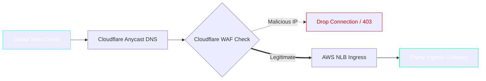
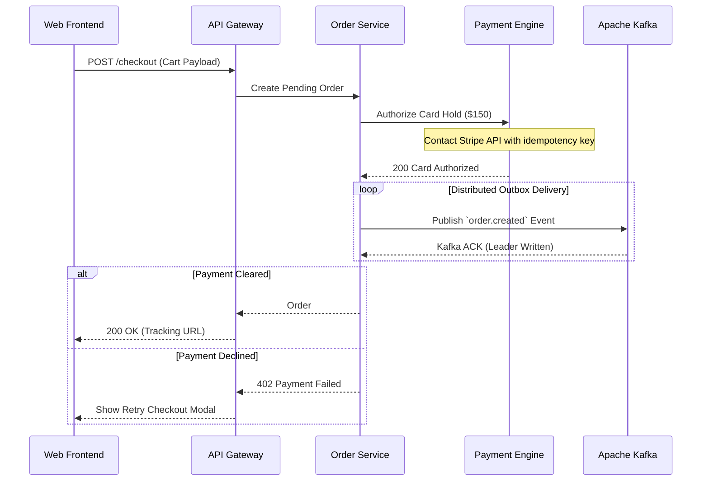
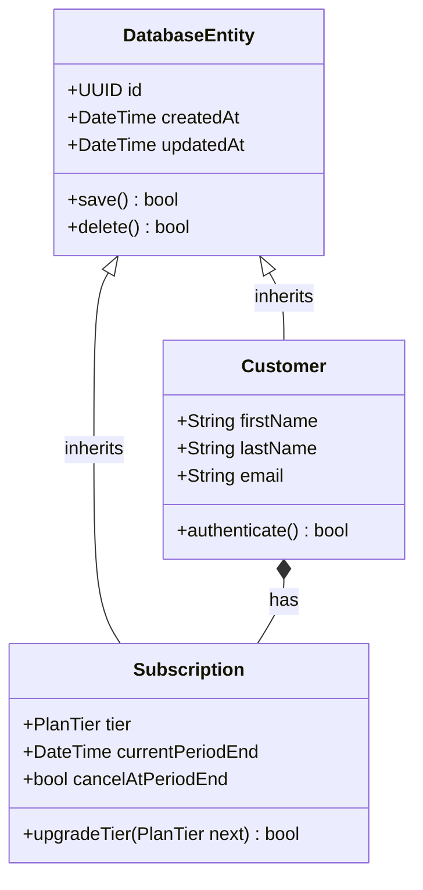

# Global Production Infrastructure & Event Flow

This technical specification details our worldwide multi-region cluster and event-driven microservice mesh.

---

## 1. Global Ingress & Traffic Management

---

## 2. Distributed Consensus & Order Processing

---

## 3. Storage Layer Domain Hierarchy

